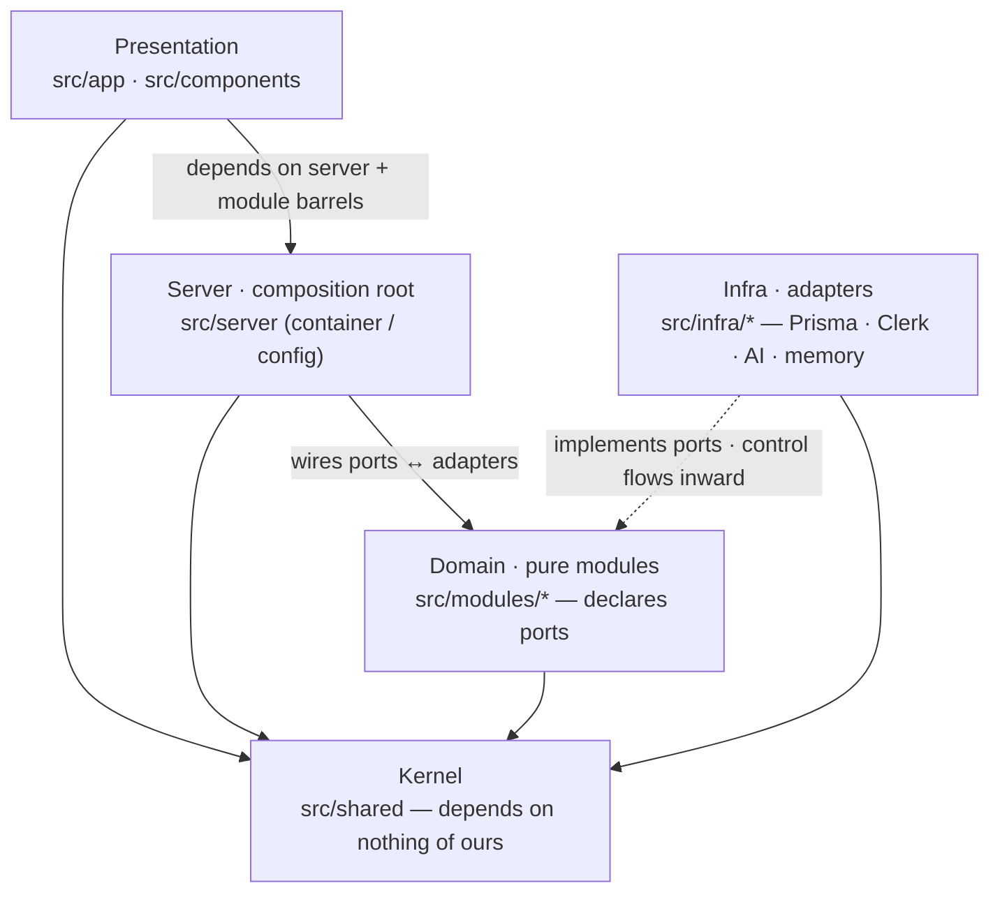
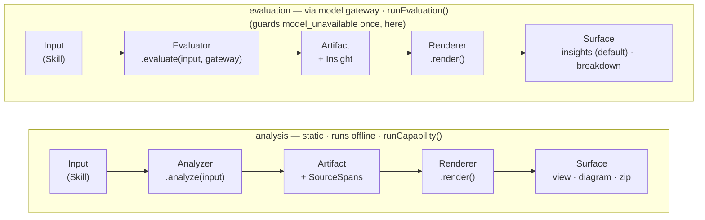

# agent.branch — module design

Agent-facing map of the codebase: the layers, the module boundaries, the
dependency rules, and where each thing lives. Read this with
[`ARCHITECTURE.md`](./ARCHITECTURE.md) (what we build & why) and
[`DESIGN.md`](./DESIGN.md) (visual system). The diagrams below are Mermaid —
they render inline on GitHub and in most editors.

> **Why this file exists:** to make the architecture *reviewable* and to keep
> future changes on-pattern. If a change doesn't fit one of the two rules in
> [§6](#6-how-to-extend-the-two-rules), that's the signal to stop and discuss.

---

## 1. The shape in one paragraph

Hexagonal + DDD. **Pure domain modules** (`src/modules/*`) hold all logic and
depend only on **ports** (interfaces they declare). **Infra** (`src/infra/*`)
implements those ports with real tech (Prisma, Clerk, the Vercel AI SDK) and
with in-memory/stub adapters for offline use. A **composition root**
(`src/server/container.ts`) is the single place ports meet adapters, chosen by
env flags. **Presentation** (`src/app`, `src/components`) renders. A shared
**kernel** (`src/shared`) carries cross-cutting primitives and depends on
nothing of ours. The **skill-analysis seam** is the spine: most features are a
capability on it, not a new pipeline.



---

## 2. Dependency rules (the boundaries)

These are the invariants a reviewer should check. They are enforced by
convention + the `index.ts` barrels (and `import "server-only"` in the
container).

| Layer | May import | Must **not** import |
|---|---|---|
| `src/shared` | nothing of ours (only std lib / npm) | anything in `src/*` of ours |
| `src/modules/<m>` | `@/shared`, other modules **via their `index.ts`** | `@/infra/*`, `@/server/*`, `@/app/*`, React |
| `src/infra/<a>` | `@/shared`, the domain **ports** it implements, npm libs | `@/server/*`, `@/app/*`, other infra adapters |
| `src/server` | `@/shared`, `@/modules/*`, `@/infra/*` | `@/app/*` |
| presentation | `@/server/*` (route handlers), `@/modules/*` barrels | `@/infra/*` directly |

**Barrel rule:** cross-module imports go through `@/modules/<m>` (the
`index.ts`), never a deep path like `@/modules/skill/skill-md`. The barrel *is*
the public surface; everything else in the folder is private by convention.

**Direction of control:** the domain declares an interface (port); infra
depends on the domain to implement it. Dependencies point *inward* toward the
domain. The composition root is the only outer-to-inner wiring point.

---

## 3. The skill-analysis seam (read this before adding a feature)

`src/modules/skill-analysis` — built once, the spine of the product
(ARCHITECTURE §3.1).



Both shapes share one `artifact → render` tail and differ only at the head, as
the diagram shows: **analysis** wraps an `Analyzer` (static, offline);
**evaluation** wraps an `Evaluator` (runs through the model gateway, can fail
`model_unavailable`). Why the split exists and which capabilities are which is
ARCHITECTURE §3.1 — this section is the mechanics. Concrete inputs are Skills
today; the generic `Input` slot lets future equipment primitives reuse the seam.

- **`ArtifactKind`** — closed union of valid kind strings (`"hero" | "skill-ir" | "export" | "lint" | "test-run" | "triggering-eval"`). Add a new member here when a new capability needs its own artifact type. Free-string kinds are a compile error.
- **`Artifact<K>`** — the base artifact type; `K` must be an `ArtifactKind`. Each capability extends this with its own fields.
- **`Analyzer<Input, A>`** — read an input, emit a structured artifact. Async +
  `Result` (some analyzers call the model).
- **`Evaluator<Input, A>`** — run the input through the model and emit a result
  artifact. Owns its *method* (builds its own scenario / battery / distractors);
  the **model gateway** is handed in (`evaluate(input, gateway)`). Composes the
  gateway's `classify` / `runAgent` / `generate` primitives; never touches the
  key or token accounting.
- **`Renderer<A, S>`** — pure, synchronous: artifact → one surface. Swapping the
  renderer is how a capability gets richer (Mermaid → React Flow; raw result →
  Insights).
- **`Insight`** — `{ verdict, summary, findings[], watch[] }`, the model-written
  interpretation an evaluator stores on its result via `gateway.generate`. The
  `insights` renderer (default, friendly) shapes it; `breakdown` exposes the raw
  cases/transcript.
- **`Capability`** — `defineCapability(...)` (analysis) or `defineEvaluation(...)`
  (evaluation): an analyzer/evaluator + named renderers.
- **`SourceSpan`** — `{ start, end }` back into `SKILL.md`. Carried by artifact
  nodes so "click → jump to source" (and later point-and-annotate) is free.
  Spans are computed with a scan-forward cursor, so duplicate headings resolve
  to the correct occurrence.

**Capabilities on the seam today:**

| Capability | Shape | Module | Analyzer / Evaluator | Renderer(s) | Status |
|---|---|---|---|---|---|
| Hero | analysis | `hero` | hero (sections + spans) | `rendered`, `source` | real |
| Visualise | analysis | `visualise` | IR extraction | `mermaid` | extraction model-backed (deterministic offline fallback); render real |
| Export | analysis | `export` | instruction intent | `claude` (manifest) | real |
| Lint | analysis | `lint` | frontmatter + body + refs quality rules + static policy rules | `insights`, `breakdown` | real |
| Test run | evaluation | `test-run` | composes `gateway.runAgent` + mock-tool registry | `insights`, `breakdown` | run + world generation real (scenario + mock tools generated, cached); email mock = offline fallback |
| Triggering eval | evaluation | `triggering-eval` | composes `gateway.classify` over the field | `insights`, `breakdown` | run + battery generation real (cached); distractor library a static v1 seed |

Run an analysis: `runCapability(heroCapability, "rendered", skill)` →
`Result<RenderedDoc, DomainError>`. Run an evaluation:
`runEvaluation(triggeringEvalCapability, "insights", skill, gateway)` →
`Result<Insight, DomainError>` (fails `model_unavailable` offline).

---

## 4. Module-by-module

Each domain module is a folder under `src/modules/` with an `index.ts` public
surface and co-located `*.test.ts`. Status legend: **real** = load-bearing
logic implemented & tested · **wired** = real integration, guarded so it no-ops
without secrets · **stub** = deterministic placeholder behind the *real*
interface (marked `STUB` in-file) · **port** = interface only.

### Domain (`src/modules`)

| Module | Public surface (`index.ts`) | Port(s) it declares | Status |
|---|---|---|---|
| **skill** | `parseSkillMd`, `serializeSkillMd`, `makeSkill`, `reviseSkill`, `skillName/Description`, `SkillBranch`/`RetentionReport` + types | `SkillRepository`, `SkillRetentionRepository` | real |
| **skill-analysis** | `defineCapability`, `runCapability`, `Analyzer/Renderer/Capability/SourceSpan/Artifact` | — | real |
| **hero** | `heroCapability`, `HeroView`, doc types | — | real |
| **visualise** | `visualiseCapability`, IR + Mermaid types | — | extraction model-backed · deterministic offline fallback · render real |
| **test-run** | `testRunCapability`, `executeSkill`, `createMockToolRegistry`, `defaultMockToolRegistry`, `emailMockTool` | `TestRunRepository` | evaluation capability · run + world generation real · email mock = offline fallback |
| **triggering-eval** | `triggeringEvalCapability`, `runTriggeringEval`, `generatePromptBattery`, `distractorLibrary` | `EvalRunRepository` | evaluation capability · run + battery generation real · adversarial negative battery · distractor library static v1 seed |
| **export** | `exportCapability`, manifest types | — | real |
| **lint** | `lintCapability`, `LintReport`, `LintFinding` | — | real (quality + pure policy rules) |
| **skill-import** | `SkillImportFetcher`, `SkillImportFetchError` | `SkillImportFetcher` | port |
| **portability** | `portabilityCapability`, `runCrossRuntimeValidation`, runtime-target/result types | — | real cross-runtime validation engine |
| **build-loop** | `runBuildLoop`, `buildTools`, `BuildToolName`, `BuildLoopEvent`, `formatTestRunFeedback`, `formatTriggeringEvalFeedback` | — (consumes `ModelGateway`) | real |
| **model-gateway** | `ModelGateway` (`classify`/`runAgent`/`streamAgent`/`generate`), `AccountingTag`, `GatewayTool`, `ModelProvider` | `ModelProvider` | real |
| **model-router** | `ModelRouter` (`resolve`/`snapshot`/`setActive`/`setCredential`/`clearCredential`), `ProviderProfile`, `ModelSelection`, `RouterSnapshot`, selection helpers | `ModelRouter` | real |
| **usage** | `checkCap`, `applyTurn`, `TIER_LIMITS`, types | `UsageRepository` | real |
| **harness-version** | `currentHarnessManifest`, `hashHarnessManifest`, manifest/version types | `HarnessVersionRepository` | real |
| **auth** | `AuthPort`, `AuthIdentity` | `AuthPort` | port |
| **baseline-corpus** | `baselineSkillCorpus`, `baselineDistractors`, `BaselineSkillCorpusEntry` + types | — | real |

**Designed next — harness improvement loop (admin).** ARCHITECTURE §9 defines the
admin loop that reads a cohort of stored evaluation records and emits a
harness-recommendation report. It is a future seam capability whose `Input` is
not a `Skill`: the input is an aggregate cohort of `eval_runs` / `test_runs`
pinned by skill version and harness version. If the recommendation method is
model-written, it is an evaluation capability (`defineEvaluation`) and spends
with a `platform` accounting tag; if it is static correlation, it is an analysis
capability. The one new persistence boundary is an admin-only aggregate-read
port over evaluation records, implemented in both Prisma and memory adapters and
gated through `isAdmin` before any route or surface can call it. The default read
model returns outcomes/features rather than raw skill or prompt content.

**Stub boundaries (where the real interface is set but behaviour is a
placeholder):** none.

**Eval feedback (build loop — closeable with eval results).** `formatTestRunFeedback`
and `formatTriggeringEvalFeedback` are pure functions in `build-loop` that translate
a structured evaluation artifact into an actionable user message; the client appends
it to the conversation and re-submits, so Claude revises against observed evidence
rather than guessing. Lives in `build-loop` (not the eval modules) because "what
does Claude need to revise this skill?" is a build concern, not an evaluation
concern (ARCHITECTURE §2 *Eval feedback*, §4 *Eval → build feedback*).

### Infra (`src/infra`)

| Adapter | Implements | Notes |
|---|---|---|
| `memory/{skill,usage,test-run,eval,harness-version}.memory-repository.ts` | the five repos + `SkillRetentionRepository` | **offline default**, tested; skill repo + retention share one store |
| `prisma/client.ts` | — | PrismaClient + `@prisma/adapter-pg` (Prisma 7 driver adapter) |
| `prisma/{skill,usage,test-run,eval,harness-version}.prisma-repository.ts` | `SkillRepository` (+ `SkillRetentionRepository`), `UsageRepository`, `TestRunRepository`, `EvalRunRepository`, `HarnessVersionRepository` | real |
| `prisma/user-provisioning-auth.ts` | `AuthPort` | wraps Clerk auth, provisions the `users` row on first sight |
| `ai/model-gateway.ts` | `ModelGateway` | the metered gateway; resolves a `LanguageModel` per call from a `ModelRouter` (or a static `ModelProvider` in tests); routes accounting through `usage` |
| `ai/model-router.ts` | `ModelRouter` | the provider/model selection authority: builds providers from the registry + server-pool keys, holds the runtime active selection + bring-your-own overrides (process-local), and resolves per primitive. Secret-free snapshot |
| `ai/anthropic-provider.ts` | `ModelProvider` | Claude via `@ai-sdk/anthropic`; `model: null` when no key |
| `ai/nous-provider.ts` | `ModelProvider` | Nous Portal via `@ai-sdk/openai-compatible`; `model: null` when no key |
| `ai/stub-provider.ts` | `ModelProvider` | always `model: null` |
| `clerk/clerk-auth.ts` | `AuthPort` | real Clerk server auth |
| `clerk/stub-auth.ts` | `AuthPort` | fixed dev identity |
| `github/skill-import-fetcher.ts` | `SkillImportFetcher` | fetches a `SKILL.md` from a GitHub URL; guarded (requires token) |

### Server (`src/server`)

- `config.ts` — reads env → `AppConfig` with `flags { hasDatabase, hasModel, hasAuth }`
  and the **provider registry** (`providerRegistry` + `serverKeys` + `defaultSelection`)
  the model router is built from.
- `container.ts` — `getContainer(): AppContainer` (cached). Picks Prisma vs
  memory, Clerk vs stub **by flag**; builds the **model router** from the registry
  and wires the gateway to resolve through it (no model ⇒ `model_unavailable`).
  `import "server-only"`.
- `build-stream.ts` — `buildLoopResponse(input, gateway, skills, userId)`: drives
  `runBuildLoop` and encodes events as an SSE `Response`.

### Presentation (`src/app`, `src/components`)

- `app/page.tsx` (server) builds a demo skill and renders it through
  `heroCapability` → `AppShell`.
- `app/api/build/route.ts` — auth → stream; the **model gateway** gates the
  `build` cap and resolves the model through the router (the route never touches
  the raw model or keys).
- `app/api/{test-run,triggering-eval}/route.ts` — auth → evaluation stream when
  requested; records runs against the current skill version.
- `app/api/model-router/route.ts` — **admin-gated** (the selection is
  instance-wide): GET the secret-free router snapshot, POST to switch the active
  provider/model or store/clear a bring-your-own key. With Clerk auth on, only an
  admin (`config.admin` allowlist, via `isAdmin`) passes — others get 403; with
  auth off it is open (dev); an empty allowlist locks it (fail-safe). Drives the
  **model console**.
- `app/layout.tsx` — next/font + conditional `ClerkProvider`; `globals.css`
  holds the DESIGN tokens as CSS variables; `proxy.ts` is Clerk/passthrough.
- `components/` — `app-shell`, `top-bar`, `side-rail`, `hero-panel`,
  `view-toggle`, `tool-chips`, `interaction-panel`, `model-console` (the
  provider/model + auth overlay, opened from the rail), `ui/{chip,button,pill}`.

---

## 5. The kernel (`src/shared`)

| Export | Purpose |
|---|---|
| `Result<T,E>`, `ok`, `err`, `isOk/isErr`, `mapResult`, `unwrap` | explicit success/failure at boundaries (domain returns these, doesn't throw across modules) |
| branded ids: `SkillId`, `UserId`, `SkillVersionId`, `TestRunId`, `EvalRunId` | structural string ids that don't interchange |
| `DomainError`, `domainError`, `notConfigured` | **closed discriminated union** — `tag` is the discriminant; callers can switch exhaustively. New tags go here, not in modules. |
| `SseEvent`, `encodeSse` | the typed SSE envelope shared by loop (server) and preview (client) |

**Known `DomainError` tags:**

| Tag | When |
|---|---|
| `not_configured` | adapter asked to act, backing service not set up (add secret to `.env.local`) |
| `not_found` | resource look-up returned nothing |
| `persistence_failed` | database operation failed |
| `auth_failed` | identity could not be resolved |
| `model_unavailable` | no model configured (offline / no key) |
| `cap_reached` | a model exists, but an `account` call hit a tier cap (the §8 graceful-degradation catch) |
| `input_too_large` | a request payload exceeded a size/depth/count bound ([ARCHITECTURE §6](./ARCHITECTURE.md#6-data-model-sketch)) |
| `invalid_operation` | a structurally invalid request (e.g. discarding the main lineage, promoting an empty draft) → 409 |
| `seam_analyze_failed` | analyzer threw during seam execution |

Add a new tag to the union in `errors.ts` only when none of the above fits. Free-string tags are a compile error.

---

## 6. How to extend (the two rules)

Almost every change is one of these. If a task fits neither, surface it.

1. **New capability / view / analysis** → a **capability on the seam**.
   Ask *"what input, artifact, and renderer is this?"* before *"what service?"*. Write an
   `Analyzer` (if a new artifact) and one or more `Renderer`s, compose with
   `defineCapability`, expose from the module's `index.ts`. No new pipeline.

2. **New external service / persistence** → a **port + adapter**.
   Declare the interface in the owning domain module (e.g.
   `skill.repository.ts`), implement it in `src/infra/<tech>/`, and wire it in
   `container.ts` behind a config flag (with a memory/stub fallback so the app
   still boots offline).

**Worked example — branching iteration (landed, [#128](https://github.com/CrowBe/agentbranch/issues/128); ARCHITECTURE §9.3).** The draft/main/promote substrate is a rule-2 change, not rule-1: it changes *which* `SkillSource` the seam runs against, never the seam's `artifact → render` shape, so no new capability/`ArtifactKind`/renderer. It extends the **existing `SkillRepository` port** (`skill.repository.ts`) with branch/promote reads and writes (`createBranch`/`saveToBranch`/`listBranches`/`listBranchVersions`/`promoteBranch`/`discardBranch`) — implemented in *both* the Prisma and memory adapters, tested as one contract at that seam — and adds **one new retention port** (`SkillRetentionRepository`, daily cleanup off the write path), wired in `container.ts` with a memory fallback and driven by a Vercel Cron route (`app/api/cron/retention`). No new domain module, so §4's table keeps the same rows (only the skill row's port list grew). The **evaluate-on-draft + promote surface** riding on it ([#129](https://github.com/CrowBe/agentbranch/issues/129)) is likewise not a rule-1 change: thin route handlers expose the branch/promote methods (`app/api/skills/[id]/branches/…`) and the app shell holds the draft-vs-main presentation state. Evaluation-on-draft is a version-*pin* change in the eval routes (a shared `resolvePinnedVersionId` keyed on `branchId`), not a new renderer — the seam's `artifact → render` tail is untouched, exactly as ARCHITECTURE §9.3 predicted.

**Other conventions**

- Return `Result` from fallible domain functions; only `unwrap` at trusted
  edges (tests, top-level handlers).
- Keep types co-located in the module and re-export from `index.ts`.
- New module? Mirror the layout: `index.ts` (barrel) + `<name>.types.ts` +
  logic files + `<name>.repository.ts` (if persisted) + `<name>.test.ts`.
- Anything model- or IO-driven that you can't finish: implement the **real
  interface**, stub the body, mark it `STUB` with a one-line note on what v1
  replaces it with.

---

## 7. Commands & runtime facts

```bash
npm run dev        # run the app           npm run typecheck   # tsc --noEmit
npm run build      # production build      npm run lint        # eslint
npm test           # vitest (run once)     npm run test:watch
npm run db:generate / db:push / db:migrate # Prisma (needs DATABASE_URL)
```

- **Boots with no secrets.** Missing `DATABASE_URL` / Clerk keys / selected
  model-provider key (`ANTHROPIC_API_KEY` or `NOUS_API_KEY`) ⇒ memory + stub
  adapters. Copy `.env.example` → `.env.local` to switch to real services.
- Stack: Next 16 (App Router) · React 19 · Prisma 7 (pg driver adapter,
  `prisma.config.ts`) · Clerk 7 · Vercel AI SDK 6 (`@ai-sdk/anthropic`,
  `@ai-sdk/openai-compatible`, Claude default with optional Nous Portal) ·
  Tailwind 4 · Vitest 4 · npm.
- Data model lives in `prisma/schema.prisma` (ARCHITECTURE §6): `users`,
  `skills`, `skill_branches`, `skill_versions` (append-only), `usage`,
  `harness_versions`, `test_runs`, `eval_runs`. Migrations under
  `prisma/migrations/`.

---

## 8. Review checklist

- [ ] Do the layer boundaries hold? (no `@/infra` import from a domain module;
      cross-module imports go through barrels)
- [ ] Is the seam the right spine — are hero/visualise/export genuinely
      renderers, or is something leaking pipeline?
- [ ] Are the ports at the right grain (repositories, `ModelProvider`,
      `AuthPort`)? Anything that should be a port but is hard-wired?
- [ ] Are the stub boundaries in the right places, with real interfaces around
      them?
- [ ] Data model: does `skill_versions` append-only + export-from-record match
      how export/eval should evolve?
- [ ] Anything in `ARCHITECTURE.md` that this structure makes awkward to build?
