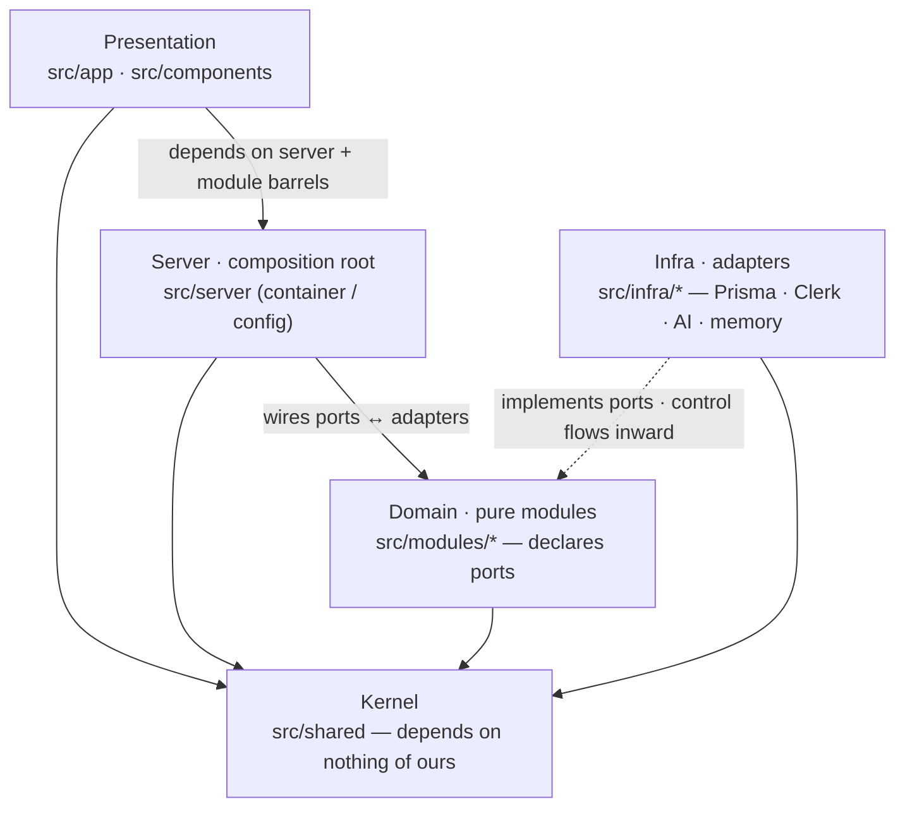
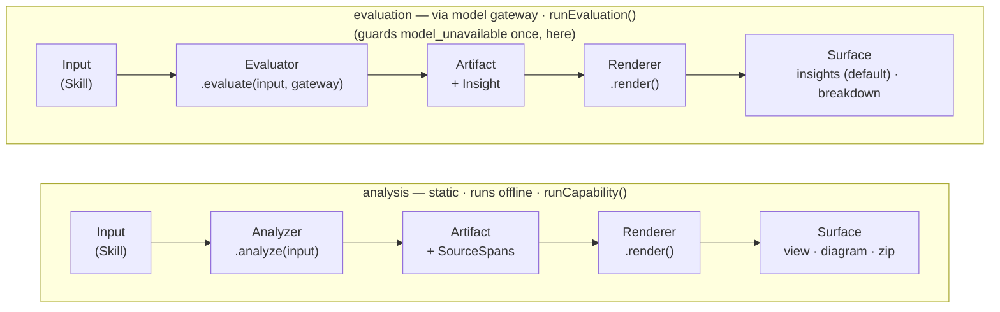

# agent.branch — module design

Agent-facing map of the codebase: the layers, the module boundaries, the
dependency rules, and where each thing lives. Read this with
[`ARCHITECTURE.md`](./ARCHITECTURE.md) (what we build & why) and
[`DESIGN.md`](./DESIGN.md) (visual system). The diagrams below are Mermaid —
they render inline on GitHub and in most editors.

> **Why this file exists:** to make the architecture *reviewable* and to keep
> future changes on-pattern. If a change doesn't fit one of the two rules in
> [§6](#6-how-to-extend-the-two-rules), that's the signal to stop and discuss.

---

## 1. The shape in one paragraph

Hexagonal + DDD. **Pure domain modules** (`src/modules/*`) hold all logic and
depend only on **ports** (interfaces they declare). **Infra** (`src/infra/*`)
implements those ports with real tech (Prisma, Clerk, the Vercel AI SDK) and
with in-memory/stub adapters for offline use. A **composition root**
(`src/server/container.ts`) is the single place ports meet adapters, chosen by
env flags. **Presentation** (`src/app`, `src/components`) renders. A shared
**kernel** (`src/shared`) carries cross-cutting primitives and depends on
nothing of ours. The **skill-analysis seam** is the spine: most features are a
capability on it, not a new pipeline.



---

## 2. Dependency rules (the boundaries)

These are the invariants a reviewer should check. They are enforced by
convention + the `index.ts` barrels (and `import "server-only"` in the
container).

| Layer | May import | Must **not** import |
|---|---|---|
| `src/shared` | nothing of ours (only std lib / npm) | anything in `src/*` of ours |
| `src/modules/<m>` | `@/shared`, other modules **via their `index.ts`** | `@/infra/*`, `@/server/*`, `@/app/*`, React |
| `src/infra/<a>` | `@/shared`, the domain **ports** it implements, npm libs | `@/server/*`, `@/app/*`, other infra adapters |
| `src/server` | `@/shared`, `@/modules/*`, `@/infra/*` | `@/app/*` |
| presentation | `@/server/*` (route handlers), `@/modules/*` barrels | `@/infra/*` directly |

**Barrel rule:** cross-module imports go through `@/modules/<m>` (the
`index.ts`), never a deep path like `@/modules/skill/skill-md`. The barrel *is*
the public surface; everything else in the folder is private by convention.

**Direction of control:** the domain declares an interface (port); infra
depends on the domain to implement it. Dependencies point *inward* toward the
domain. The composition root is the only outer-to-inner wiring point.

---

## 3. The skill-analysis seam (read this before adding a feature)

`src/modules/skill-analysis` — built once, the spine of the product
(ARCHITECTURE §3.1).



Both shapes share one `artifact → render` tail and differ only at the head, as
the diagram shows: **analysis** wraps an `Analyzer` (static, offline);
**evaluation** wraps an `Evaluator` (runs through the model gateway, can fail
`model_unavailable`). Why the split exists and which capabilities are which is
ARCHITECTURE §3.1 — this section is the mechanics. The generic `Input` slot is in use:
most capabilities read a `Skill`, the equipment primitives (`response-schema`,
`tool-contract`) read their own source models, and the test run reads a
`TestRunInput` bundle (ARCHITECTURE §9.2).

- **`ArtifactKind`** — closed union of valid kind strings (`"hero" | "skill-ir" | "skill-metadata" | "export" | "lint" | "response-schema-lint" | "tool-contract-lint" | "subagent-definition-lint" | "test-run" | "triggering-eval" | "cross-runtime-validation" | "safety-review" | "harness-recommendation"`). Add a new member here when a new capability needs its own artifact type. Free-string kinds are a compile error.
- **`Artifact<K>`** — the base artifact type; `K` must be an `ArtifactKind`. Each capability extends this with its own fields.
- **`Analyzer<Input, A>`** — read an input, emit a structured artifact. Async +
  `Result` (some analyzers call the model).
- **`Evaluator<Input, A>`** — run the input through the model and emit a result
  artifact. Owns its *method* (builds its own scenario / battery / distractors);
  the **model gateway** is handed in (`evaluate(input, gateway, observer?)`).
  Composes the gateway's `classify` / `runAgent` / `generate` primitives; never
  touches the key or token accounting. The optional **observer** receives
  `EvaluationRunEvent`s (`progress` | `case`) as the method unfolds — a domain
  union, mapped onto the SSE envelope at the server (the `BuildLoopEvent`
  pattern).
- **`Renderer<A, S>`** — pure, synchronous: artifact → one surface. Swapping the
  renderer is how a capability gets richer (Mermaid → React Flow; raw result →
  Insights).
- **`Insight`** — `{ verdict, summary, findings[], watch[] }`, the model-written
  interpretation an evaluator stores on its result via `gateway.generate`. The
  `insights` renderer (default, friendly) shapes it; `breakdown` exposes the raw
  cases/transcript.
- **`Capability`** — `defineCapability(...)` (analysis) or `defineEvaluation(...)`
  (evaluation): an analyzer/evaluator + named renderers.
- **`SourceSpan`** — `{ start, end }` back into `SKILL.md`. Carried by artifact
  nodes so "click → jump to source" (and later point-and-annotate) is free.
  Spans are computed with a scan-forward cursor, so duplicate headings resolve
  to the correct occurrence.

**Capabilities on the seam today:**

| Capability | Shape | Module | Analyzer / Evaluator | Renderer(s) | Status |
|---|---|---|---|---|---|
| Hero | analysis | `hero` | hero (sections + spans) | `rendered`, `source` | real |
| Visualise | analysis | `visualise` | IR extraction | `mermaid` | extraction model-backed (deterministic offline fallback); render real |
| Metadata suggest | analysis | `metadata-suggest` | editable name, description, category + tag recommendation | `suggestions` | local suggestion → metered gateway → deterministic keyword fallback; identical author-owned surface on every rung |
| Export | analysis | `export` | instruction intent | `claude` (manifest) | real |
| Lint | analysis | `lint` | frontmatter + body + refs quality rules + static policy rules | `insights`, `breakdown` | real |
| Response schema quality | analysis | `response-schema` | JSON Schema structure + smell rules (pure, zero tokens) | `insights`, `breakdown` | real |
| Tool contract quality | analysis | `tool-contract` | I/O typing, description/example quality, failure modes, safety notes (pure) | `insights`, `breakdown` | real |
| Subagent definition quality | analysis | `subagent-definition` | delegation description, role/instruction depth, tool boundaries, metadata smells (pure) | `insights`, `breakdown` | real |
| Test run | evaluation | `test-run` | composes `gateway.runAgent` + mock-tool registry over a `TestRunInput` bundle; contracts drive the mocks + per-call validation | `insights`, `breakdown` | run + world generation real (scenario + mock tools generated, cached); contract-driven mocks + checks real; email mock = offline fallback |
| Triggering eval | evaluation | `triggering-eval` | composes `gateway.classify` over the field | `insights`, `breakdown` | run + battery generation real (cached); distractor library a static v1 seed |
| Harness recommendation | analysis | `harness-recommendation` | Tier-1 correlation over a corpus cohort (fired lint rules × eval outcomes) | `report` | real; the first capability whose `Input` is not a `Skill` |

Run an analysis: `runCapability(heroCapability, "rendered", skill)` →
`Result<RenderedDoc, DomainError>`. Run an evaluation:
`runEvaluation(triggeringEvalCapability, "insights", skill, gateway, observer?)`
→ `Result<{ artifact, body }, DomainError>` (fails `model_unavailable` offline).
The outcome carries the raw Evaluation result alongside the rendered surface —
recording and eval feedback need the artifact, and handing it back here is what
keeps callers on this interface instead of reaching for the evaluator. The seam
stays persistence-free (a result is *ephemeral* here, CONTEXT.md); the
choreography around a production run — pin the version, stamp the harness
version, record the Evaluation record, shape the HTTP response — lives once in
the server's recorded-evaluation driver (`src/server/evaluation-run.ts`, §4).

---

## 4. Module-by-module

Each domain module is a folder under `src/modules/` with an `index.ts` public
surface and co-located `*.test.ts`. Status legend: **real** = load-bearing
logic implemented & tested · **wired** = real integration, guarded so it no-ops
without secrets · **stub** = deterministic placeholder behind the *real*
interface (marked `STUB` in-file) · **port** = interface only.

### Domain (`src/modules`)

| Module | Public surface (`index.ts`) | Port(s) it declares | Status |
|---|---|---|---|
| **skill** | `parseSkillMd`, `serializeSkillMd`, `makeSkill`, `reviseSkill`, `skillName/Description`, `SKILL_CATEGORIES`, `skillMetadata`, `withSkillMetadata`, `SkillBranch`/`RetentionReport` + types | `SkillRepository`, `SkillRetentionRepository` | real (discovery metadata — `category` + `tags` — lives in frontmatter extra keys, so it travels with the standard-native artifact and is pinned by the same content hash) |
| **skill-analysis** | `defineCapability`, `runCapability`, `Analyzer/Renderer/Capability/SourceSpan/Artifact` | — | real |
| **hero** | `heroCapability`, `HeroView`, doc types | — | real |
| **visualise** | `visualiseCapability`, IR + Mermaid types | — | extraction model-backed · deterministic offline fallback · render real |
| **metadata-suggest** | `metadataSuggestCapability`, `SkillMetadataSuggestion/View` | — | analysis capability · suggests editable name, description, category + tags · workspace tries the local provider before this route; the route uses the gateway then deterministic keyword fallback · writing stays with the author (`withSkillMetadata` / build-loop frontmatter edits) |
| **test-run** | `testRunCapability`, `executeSkill`, `createMockToolRegistry`, `defaultMockToolRegistry`, `emailMockTool`, `registryFromContracts`, `computeContractChecks`, `contractCheckIssues`, `toTestRunAnalysisRecord` | `TestRunRepository` | evaluation capability over a `TestRunInput` bundle · run + world generation real · contract-driven mocks + per-call validation real · email mock = offline fallback |
| **triggering-eval** | `triggeringEvalCapability`, `runTriggeringEval`, `runBatteryCases`, `generatePromptBattery`, `distractorLibrary`, `toEvalRunAnalysisRecord` | `EvalRunRepository` | evaluation capability · run + battery generation real · adversarial negative battery · distractor library static v1 seed |
| **safety-review** | `safetyReviewCapability`, `runSafetyReview`, `SafetyRating` + verdict/score types | `SafetyRatingRepository` | evaluation capability · LLM-judge over a full skill folder as structurally untrusted data · caller-tagged (opt-in rating = `account`; a platform-initiated review would tag `platform`) · records persist as safety ratings pinned to the reviewed version — the pin that earns a published version its safety badge (ARCHITECTURE §9.1) |
| **publication** | `publishSkillVersion`, `renderTapMarketplace`, `renderTapRepositoryFiles`, `renderSkillLibrary`, `renderSkillProfile`, `TAP_REPOSITORY`, `tapSkillReportUrl`, `Publication`, `SkillLibraryEntry/View`, `SkillProfileView`, `PublicationRepository`, `TapSyncTrigger` + types | `PublicationRepository`, `TapSyncTrigger` | real (pins a Skill version + content hash + slug + tier; rate-limited open publish service; pure tap marketplace + tap repository file renderers for `.claude-plugin/marketplace.json` and `skills/<owner>/<name>/SKILL.md`; pure Skill-library read model — reviewed tier surfaced, published tier link-reachable, entries enriched with pinned-frontmatter description/category/tags for filtering + search; pure skill-profile read model behind the public profile page, carrying the tap repo install address + prefilled report link; `TapSyncTrigger` is the publish-time fast path asking the public tap repo — `TAP_REPOSITORY`, CrowBe/agentbranch-tap — to sync now, best-effort by contract) |
| **export** | `exportCapability`, manifest types | — | real |
| **lint** | `lintCapability`, `summarizeLintFindings`, `LintReport`, `LintFinding` | — | real (quality + pure policy rules; `summarizeLintFindings` is the shared scorer every LintReport-shaped artifact uses) |
| **response-schema** | `responseSchemaCapability`, `parseResponseSchema`, `serializeResponseSchema`, `applyResponseSchemaEdit`, `responseSchemaName`, `schemaShapeFindings`, `validateAgainstSchema`, `exampleValueForSchema`, `responseSchemaRenderedRenderer`, `responseSchemaSourceRenderer` + types | — | real (first equipment primitive: lossless source model + pure lint + Rendered/Source hero views + offline schema-subset validation) |
| **tool-contract** | `toolContractCapability`, `parseToolContract`, `serializeToolContract`, `toolContractRenderedRenderer`, `toolContractSourceRenderer` + types | — | real (second equipment primitive: lossless source model + pure lint + Rendered/Source hero views; I/O `$ref`s response schemas) |
| **subagent-definition** | `subagentDefinitionCapability`, `parseSubagentDefinition`, `serializeSubagentDefinition`, `createSubagentDefinitionLintReport`, `subagentDefinitionLintAnalyzer`, `SUBAGENT_DEFINITION_LINT_RULESET_VERSION`, `renderSubagentDefinition`, `renderSubagentDefinitionSource`, `subagentDefinitionInsightsRenderer`, `subagentDefinitionBreakdownRenderer` + types | — | real (third equipment primitive: lossless frontmatter + body source model, pure delegation-quality lint, and seam renderers; no execution or routing) |
| **skill-import** | `SkillImportFetcher`, `SkillImportFetchError` | `SkillImportFetcher` | port |
| **portability** | `portabilityCapability`, `runCrossRuntimeValidation`, runtime-target/result types | — | real cross-runtime validation engine |
| **build-loop** | `runBuildLoop`, `buildTools`, `BuildToolName`, `BuildLoopEvent`, `formatTestRunFeedback`, `formatTriggeringEvalFeedback`, `runResponseSchemaLoop`, `responseSchemaTools`, `RESPONSE_SCHEMA_AUTHORING_PROMPT`, `formatResponseSchemaLintFeedback` | — (consumes `ModelGateway`) | real |
| **model-gateway** | `ModelGateway` (`classify`/`runAgent`/`streamAgent`/`generate`), `createModelGateway` (the accounting shell: atomic quota reserve/reconcile, request rate, byte budget, resolved-model pricing), `AccountingTag`, `GatewayTool`, `ModelProvider` | `RawModelCalls` (unmetered per-primitive model calls), `ModelProvider` | real |
| **model-router** | `ModelRouter` (`resolve`/`snapshot`/`setActive`/`setCredential`/`clearCredential`), `ProviderProfile`, `ModelSelection`, `RouterSnapshot`, selection helpers | `ModelRouter` | real |
| **usage** | `checkQuota`, `maximumTurnCost`, `pricesForModel`, `costOfTurn`, `quotaRemainingMicros`, `formatQuotaMicros`, quota/price types | `UsageRepository` (`reserve`/`release`/`reconcile`) | real; Prisma reconciliation also writes an append-only price-keyed charge |
| **harness-version** | `currentHarnessManifest`, `hashHarnessManifest`, manifest/version types | `HarnessVersionRepository` | real |
| **auth** | `AuthPort`, `AuthIdentity` | `AuthPort` | port |
| **baseline-corpus** | `baselineSkillCorpus`, `baselineDistractors`, `BaselineSkillCorpusEntry` + types | — | real |
| **response-schema-corpus** | `responseSchemaCorpus`, `ResponseSchemaCorpusEntry` | — | real (curated, hash-pinned response-schema fixtures with frozen lint expectations) |
| **tool-contract-corpus** | `toolContractCorpus`, `toolContractBundleFixtures`, `ToolContractCorpusEntry`, `ToolContractBundleFixture` | — | real (curated, hash-pinned tool-contract fixtures with frozen lint expectations and composed bundle test-run inputs) |
| **adversarial-safety-battery** | `adversarialSafetyBattery`, `adversarialTriggeringNegativePrompts`, `AdversarialCase` + types | — | real (curated, hash-pinned malicious/deceptive whole-folder fixtures across the §9.1 threat classes; freezes static policy expectations and documented latent non-detection) |
| **harness-recommendation** | `harnessRecommendationCapability`, `CorpusCohort`, `HarnessRecommendationReport` + types | — | real (Tier-1 static correlation) |
| **regression-benchmark** | `regressionBenchmarkSet`, `regressionBenchmarkSetHash`, `runRegressionBenchmark`, `BenchmarkRun` + types | `BenchmarkRunRepository` | real |

**Harness improvement loop (admin).** ARCHITECTURE §9 carries the design; the
build spans three seams. The **aggregate read** is `listForAnalysis` on
`EvalRunRepository` / `TestRunRepository` — the one read on those ports not
scoped to a user, implemented in both Prisma and memory adapters against a
shared outcomes/features projection (`toEvalRunAnalysisRecord` /
`toTestRunAnalysisRecord`): user identity, prompt text, and skill content never
cross into it, and the skill version's stored lint summary (score + fired
rules) rides along as the static feature set. The **report** is the
`harness-recommendation` module — an analysis capability whose `Input` is the
corpus cohort. The **measurement guardrail** is the `regression-benchmark`
module: the baseline corpus + curated batteries as a hash-pinned frozen set,
scored through the triggering eval's competitive selection (`runBatteryCases`,
candidate excluded from its own distractor field, `platform`-tagged) and
recorded per harness version behind `BenchmarkRunRepository`. All three surface
only through the admin routes (below), gated by `isAdmin`.

**Stub boundaries (where the real interface is set but behaviour is a
placeholder):** none.

**Eval feedback (build loop — closeable with eval results).** `formatTestRunFeedback`
and `formatTriggeringEvalFeedback` are pure functions in `build-loop` that translate
a structured evaluation artifact into an actionable user message; the client appends
it to the conversation and re-submits, so Claude revises against observed evidence
rather than guessing. Lives in `build-loop` (not the eval modules) because "what
does Claude need to revise this skill?" is a build concern, not an evaluation
concern (ARCHITECTURE §2 *Eval feedback*, §4 *Eval → build feedback*).

**Equipment authoring (issue #151).** The build loop's shape carries the first
two equipment primitives through one pattern: one frozen, cacheable system
prompt per primitive, a `write_*`/`edit_*` tool pair mirroring
`write_skill`/`edit_skill`, and lint feedback after a write. Response schemas
use `runResponseSchemaLoop` with `RESPONSE_SCHEMA_AUTHORING_PROMPT` and the
`write_response_schema`/`edit_response_schema` tools; tool contracts use
`runToolContractLoop` with `TOOL_CONTRACT_AUTHORING_PROMPT` and the
`write_tool_contract`/`edit_tool_contract` tools. Both prompts inherit the
skill prompt's spine (interview-first, readiness checklist gating the first
write, "just draft it" as a command, building-block right-sizing) specialised
to their primitive. `formatResponseSchemaLintFeedback` and
`formatToolContractLintFeedback` close each loop with the primitive's pure lint,
exactly as skill lint feedback does. Later primitives repeat the pattern when
they become chat-buildable (ARCHITECTURE §9.2 order).

### Infra (`src/infra`)

| Adapter | Implements | Notes |
|---|---|---|
| `memory/{skill,usage,test-run,eval,safety-rating,harness-version,benchmark}.memory-repository.ts` | the seven repos + `SkillRetentionRepository` | **offline default**, tested; skill repo + retention share one store; the eval/test-run adapters take an optional lint-summary resolver over that store for the analysis reads |
| `memory/publication.memory-repository.ts` | `PublicationRepository` | offline default; shares the skill store to enforce publisher ownership of the pinned version and to read pinned Skill version sources for tap repository rendering |
| `prisma/client.ts` | — | PrismaClient + `@prisma/adapter-pg` (Prisma 7 driver adapter) |
| `prisma/{skill,usage,test-run,eval,safety-rating,harness-version,benchmark}.prisma-repository.ts` | `SkillRepository` (+ `SkillRetentionRepository`), `UsageRepository`, `TestRunRepository`, `EvalRunRepository`, `SafetyRatingRepository`, `HarnessVersionRepository`, `BenchmarkRunRepository` | real; the eval/test-run analysis reads join `skill_versions.lint_summary_json` |
| `prisma/publication.prisma-repository.ts` | `PublicationRepository` | real; writes only when the version belongs to the publisher and the slug is unused; joins the pinned Skill version source for tap repository rendering |
| `prisma/user-provisioning-auth.ts` | `AuthPort` | wraps Clerk auth, provisions the `users` row on first sight |
| `ai/sdk-model-calls.ts` | `RawModelCalls` | SDK translation only: message/tool mapping, stream-part mapping, token-usage shape reading, provider cap-error detection. Admission + recording live above it, in the model-gateway module's accounting shell (`createModelGateway`), so policy holds for every adapter by construction |
| `ai/model-router.ts` | `ModelRouter` | the provider/model selection authority: builds providers from the registry + server-pool keys, holds the runtime active selection + bring-your-own overrides (process-local), and resolves per primitive. Secret-free snapshot |
| `ai/anthropic-provider.ts` | `ModelProvider` | Claude via `@ai-sdk/anthropic`; `model: null` when no key |
| `ai/nous-provider.ts` | `ModelProvider` | Nous Portal via `@ai-sdk/openai-compatible`; `model: null` when no key |
| `ai/stub-provider.ts` | `ModelProvider` | always `model: null` |
| `clerk/clerk-auth.ts` | `AuthPort` | real Clerk server auth |
| `clerk/stub-auth.ts` | `AuthPort` | fixed dev identity |
| `github/skill-import-fetcher.ts` | `SkillImportFetcher` | fetches a `SKILL.md` from a GitHub URL; guarded (requires token) |
| `github/tap-sync-trigger.ts` | `TapSyncTrigger` | fires the `publish` repository_dispatch at the public tap repo so its publish-sync workflow opens + auto-merges the bot PR; guarded (requires `TAP_SYNC_TOKEN`), with a disabled fallback that defers to the tap repo's scheduled reconciliation sweep |

### Server (`src/server`)

- `config.ts` — reads env → `AppConfig` with `flags { hasDatabase, hasModel, hasAuth }`
  and the **provider registry** (`providerRegistry` + `serverKeys` + `defaultSelection`)
  the model router is built from.
- `container.ts` — `getContainer(): AppContainer` (cached). Picks Prisma vs
  memory, Clerk vs stub **by flag**; builds the **model router** from the registry
  and wires the gateway to resolve through it (no model ⇒ `model_unavailable`).
  `import "server-only"`.
- `build-stream.ts` — `buildLoopResponse(input, gateway, skills, userId)`: drives
  `runBuildLoop` and encodes events as an SSE `Response`.
- `response-schema-stream.ts` — `responseSchemaLoopResponse(input, gateway, userId)`:
  the equipment-authoring driver. Drives `runResponseSchemaLoop`, applies streamed
  edits to the working draft, follows each write with the primitive's lint feedback,
  and encodes events as an SSE `Response`. No persistence — equipment is
  session-kept by the client workspace.
- `evaluation-run.ts` — `evaluationResponse({kind, surface, sse, skill, pin, deps})`:
  the recorded-evaluation driver the evaluation routes share. Runs the seam's
  `runEvaluation`, then the persistence choreography — resolve the pinned
  version, stamp the harness version, record via a kind-keyed dispatch
  (`test-run` → `TestRunRepository`, `triggering-eval` → `EvalRunRepository`,
  `safety-review` → `SafetyRatingRepository`, exhaustively checked) — and
  shapes the response: 503 offline *before* any stream opens, SSE (observer
  events → `EvaluationEvent`) when asked, JSON otherwise. Ports are handed in,
  so the whole choreography is tested against memory adapters. The
  safety-review entry declares the `account` tag on its input — the opt-in
  rating is the user's own spend (ARCHITECTURE §9.1).

### Presentation (`src/app`, `src/components`)

- `app/page.tsx` (server) builds a demo skill and renders it through
  `heroCapability` → `AppShell`.
- `app/api/build/route.ts` — auth → stream; the **model gateway** gates the
  `build` cap and resolves the model through the router (the route never touches
  the raw model or keys).
- `app/api/{test-run,triggering-eval}/route.ts` — thin HTTP adapters: auth →
  parse → one call into the recorded-evaluation driver (`evaluation-run.ts`),
  identical except for the capability they name. The test-run route also
  accepts the optional bundle (`toolContracts` / `responseSchemas` as raw JSON
  documents), parsed through the primitives' source models before the run.
- `app/api/safety-review/route.ts` — the opt-in safety rating (ARCHITECTURE
  §9.1). POST runs the safety review through the recorded-evaluation driver and
  answers with the full rating (verdict + scores + Insight) in one shape, so
  the client renders Insights and the breakdown locally and switching surfaces
  never re-spends; GET answers whether the current head version (main or a
  named draft) already carries a rating, which is what makes the offer show
  only for an unrated version.
- `app/api/{response-schema,tool-contract}/route.ts` — the equipment
  primitives' quality checks: auth → parse the raw document through the
  module's source model → `runCapability` (pure, offline) → Insights or
  Breakdown JSON.
- `app/api/response-schema/build/route.ts` — the response-schema authoring
  route (issue #151): auth → parse (messages + optional current draft through
  the source model) → one call into the equipment-authoring driver
  (`response-schema-stream.ts`), streaming SSE. The gateway gates the `build`
  capability, exactly like a skill build turn.
- `app/api/tool-contract/build/route.ts` — the tool-contract authoring route:
  the same equipment-authoring route shape, with the optional current draft
  parsed through the tool-contract source model and streamed through
  `tool-contract-stream.ts`.
- `app/api/skill-library/route.ts` — the publication-backed Skill library feed
  (ARCHITECTURE §9.1): GET renders `renderSkillLibrary` over the visible
  publications joined with their pinned version sources — `?surface=templates`
  is the Templates view over the reviewed tier, `?q=` searches surfaced entries
  (name, owner, slug, description, category, tags), `?category=` / `?tag=`
  filter on the pinned frontmatter metadata, `?slug=` looks up one publication
  (published entries resolve by slug with their safety badge or potentially-unsafe
  label). Pure read; offline-safe.
- `app/api/metadata-suggest/route.ts` — name, description, and discovery-metadata suggestions for the
  skill in the request: auth → parse → `runCapability(metadataSuggestCapability)`
  with the gateway + an `account` tag (`metadata-suggest` capability). This is
  rung two of the workspace ladder: local provider → this
  gateway route → its deterministic keyword fallback. All rungs return the
  same suggestion shape; unsupported browsers therefore keep identical UI.
  Model-backed when configured, deterministic keyword fallback offline;
  returns a suggestion, never writes. Author acceptance checkpoints the
  active main or draft lineage through `PATCH /api/skills/[id]`; an unsaved
  workspace instead labels the accepted change as unsaved.
- `app/skills/[owner]/[name]/page.tsx` — the public skill profile page
  (ARCHITECTURE §9.1): server-rendered, force-dynamic (a takedown revert or new
  rating must be visible immediately). Resolves the visible publication by
  slug, renders `renderSkillProfile` (identity, trust tier, badge/flag,
  category + tags, content hash, the tap repo install source, and the report
  link — the tap repo's issue form with slug + hash prefilled) plus the pinned
  source through the hero capability's `rendered` view. 404 for missing or
  private slugs.
- `app/api/tap-repository/route.ts` — the public tap repository snapshot
  (ARCHITECTURE §9.1): GET renders the exact file set the bot PR writes —
  `.claude-plugin/marketplace.json` plus `skills/<owner>/<name>/SKILL.md` —
  from visible publications, their pinned Skill version sources, and the latest
  safety ratings. Hash mismatches return a domain error before any file content
  is emitted.
- `app/api/publications/route.ts` — the open publish write surface
  (ARCHITECTURE §9.1): POST authenticates, resolves the user's main version,
  pins its `SKILL.md` content hash, and invokes `publishSkillVersion` as a
  `published` publication. Safety ratings are badge data only; this route never
  requires or runs one. On success it asks the public tap repo to sync via the
  `TapSyncTrigger` — best-effort: an "unavailable" outcome is reported in the
  response and left to the tap repo's scheduled sweep, never a publish failure.
- `app/api/model-router/route.ts` — **admin-gated** (the selection is
  instance-wide): GET the secret-free router snapshot, POST to switch the active
  provider/model or store/clear a bring-your-own key. With Clerk auth on, only an
  admin (`config.admin` allowlist, via `isAdmin`) passes — others get 403; with
  auth off it is open (dev); an empty allowlist locks it (fail-safe). Drives the
  **model console**. The gate itself is the shared `_shared/admin-gate.ts`
  helper.
- `app/api/admin/harness-report/route.ts` — **admin-gated** (same gate): GET
  assembles the corpus cohort from the two `listForAnalysis` reads and renders
  the harness-recommendation report. Offline-safe (static correlation);
  `?limit=` / `?since=` bound the cohort; the response carries
  outcomes/features, never skill or prompt content.
- `app/api/admin/benchmark/route.ts` — **admin-gated** (same gate): GET the
  score-over-harness-versions view of recorded benchmark runs; POST scores the
  frozen set now (`platform`-tagged spend) and records the run pinned to the
  current harness version. 503 offline, like every evaluation surface.
- `app/layout.tsx` — next/font + conditional `ClerkProvider`; `globals.css`
  holds the DESIGN tokens as CSS variables; `proxy.ts` is Clerk/passthrough.
- `components/` — `app-shell`, `top-bar`, `side-rail`, `hero-panel`,
  `view-toggle`, `tool-chips`, `interaction-panel`, `mermaid-diagram` (client
  Mermaid render of the visualise capability's source, token-themed, source
  block as fallback), `model-console` (the provider/model + auth overlay,
  opened from the rail), `ui/{chip,button,pill,segmented}`,
  and `workspace/` — the **client workspace module**
  ([#159](https://github.com/CrowBe/agentbranch/issues/159)): a framework-free
  store owning the HTTP protocol and the request choreography behind a small
  interface — actions (build turn, import, open skill, restore, draft/promote/
  discard, run tool, metadata suggestion/apply, lint, equipment, Templates search) over one immutable snapshot. Every route
  response is decoded once, in `workspace/decoders.ts`, against the domain
  modules' exported types — shape drift breaks there, loudly, not in scattered
  guards. The build loop's SSE stream and the evaluation streams are consumed
  here too. `use-workspace.ts` (`useSyncExternalStore`) is its one React
  touchpoint; the app shell is composition/JSX only — no fetch calls, no
  `unknown` guards — and workspace behaviour (choreography, decoding, error
  paths) is tested without rendering React (`workspace.test.ts`).
  `workspace/local-suggestion-provider.ts` owns the browser-side local
  suggestion port, its Prompt API adapter, and the deterministic adapter used
  in choreography tests. The Prompt API adapter caches one availability probe
  per workspace session, accepts only an already-`available` model, creates a
  short-lived session per suggestion, constrains output with JSON Schema, and
  truncates long skill source before prompting. `suggestLocallyOrRoute` is the
  first-available-wins boundary: missing or malformed local output silently
  falls through to the feature's existing server route. This client-only seam
  deliberately does not touch the gateway, router, or accounting layers.
  Metadata is the pilot: its hero action uses this provider first, then
  `/api/metadata-suggest`; the route retains its deterministic fallback. The
  suggestion never mutates `SKILL.md` until the author selects **Apply
  suggestion**, and a changed description nudges them toward Triggering eval.
  The interaction panel's Equipment mode (side-rail entry) accepts both kinds
  of input: a pasted JSON document is checked against the two quality routes
  above, and a plain-language message drives the response-schema authoring
  loop (`/api/response-schema/build`) — the workspace streams the
  conversation, tracks the draft through write/edit events, hands lint
  feedback back as the next turn, and quality-checks + keeps the finished
  schema exactly like a pasted one. Kept equipment lives for the session; the
  workspace bundles kept contracts into the next test run, and the breakdown
  panel shows the per-call contract checks.
  The Templates mode consumes `/api/skill-library?surface=templates` through
  the same decoder/action pattern, with search over reviewed entries and
  badge/flag, trust tier, content hash, and footprint copy surfaced before a
  user follows the install details.

---

## 5. The kernel (`src/shared`)

| Export | Purpose |
|---|---|
| `Result<T,E>`, `ok`, `err`, `isOk/isErr`, `mapResult`, `unwrap` | explicit success/failure at boundaries (domain returns these, doesn't throw across modules) |
| branded ids: `SkillId`, `UserId`, `SkillVersionId`, `TestRunId`, `EvalRunId`, `SafetyRatingId` | structural string ids that don't interchange |
| `DomainError`, `domainError`, `notConfigured` | **closed discriminated union** — `tag` is the discriminant; callers can switch exhaustively. New tags go here, not in modules. |
| `SseEvent`, `encodeSse` | the typed SSE envelope shared by loop (server) and preview (client) |

**Known `DomainError` tags:**

| Tag | When |
|---|---|
| `not_configured` | adapter asked to act, backing service not set up (add secret to `.env.local`) |
| `not_found` | resource look-up returned nothing |
| `persistence_failed` | database operation failed |
| `auth_failed` | identity could not be resolved |
| `model_unavailable` | no model configured (offline / no key) |
| `cap_reached` | a model exists, but an `account` call is out of free quota — or hit a structural bound (skill count, request rate) or the §8 provider cap-catch |
| `input_too_large` | a request payload exceeded a size/depth/count bound ([ARCHITECTURE §6](./ARCHITECTURE.md#6-data-model-sketch)) |
| `invalid_operation` | a structurally invalid request (e.g. discarding the main lineage, promoting an empty draft) → 409 |
| `seam_analyze_failed` | analyzer threw during seam execution |

Add a new tag to the union in `errors.ts` only when none of the above fits. Free-string tags are a compile error.

---

## 6. How to extend (the two rules)

Almost every change is one of these. If a task fits neither, surface it.

1. **New capability / view / analysis** → a **capability on the seam**.
   Ask *"what input, artifact, and renderer is this?"* before *"what service?"*. Write an
   `Analyzer` (if a new artifact) and one or more `Renderer`s, compose with
   `defineCapability`, expose from the module's `index.ts`. No new pipeline.

2. **New external service / persistence** → a **port + adapter**.
   Declare the interface in the owning domain module (e.g.
   `skill.repository.ts`), implement it in `src/infra/<tech>/`, and wire it in
   `container.ts` behind a config flag (with a memory/stub fallback so the app
   still boots offline).

**Worked example — branching iteration (landed, [#128](https://github.com/CrowBe/agentbranch/issues/128); ARCHITECTURE §9.3).** The draft/main/promote substrate is a rule-2 change, not rule-1: it changes *which* `SkillSource` the seam runs against, never the seam's `artifact → render` shape, so no new capability/`ArtifactKind`/renderer. It extends the **existing `SkillRepository` port** (`skill.repository.ts`) with branch/promote reads and writes (`createBranch`/`saveToBranch`/`listBranches`/`listBranchVersions`/`promoteBranch`/`discardBranch`) — implemented in *both* the Prisma and memory adapters, tested as one contract at that seam — and adds **one new retention port** (`SkillRetentionRepository`, daily cleanup off the write path), wired in `container.ts` with a memory fallback and driven by a Vercel Cron route (`app/api/cron/retention`). No new domain module, so §4's table keeps the same rows (only the skill row's port list grew). The **evaluate-on-draft + promote surface** riding on it ([#129](https://github.com/CrowBe/agentbranch/issues/129)) is likewise not a rule-1 change: thin route handlers expose the branch/promote methods (`app/api/skills/[id]/branches/…`) and the client workspace (`components/workspace`) holds the draft-vs-main state. Evaluation-on-draft is a version-*pin* change (the evaluation-run driver's `resolvePinnedVersionId`, keyed on `branchId`), not a new renderer — the seam's `artifact → render` tail is untouched, exactly as ARCHITECTURE §9.3 predicted.

**Other conventions**

- Return `Result` from fallible domain functions; only `unwrap` at trusted
  edges (tests, top-level handlers).
- Keep types co-located in the module and re-export from `index.ts`.
- New module? Mirror the layout: `index.ts` (barrel) + `<name>.types.ts` +
  logic files + `<name>.repository.ts` (if persisted) + `<name>.test.ts`.
- Anything model- or IO-driven that you can't finish: implement the **real
  interface**, stub the body, mark it `STUB` with a one-line note on what v1
  replaces it with.

---

## 7. Commands & runtime facts

```bash
npm run dev        # run the app           npm run typecheck   # tsc --noEmit
npm run build      # production build      npm run lint        # eslint
npm test           # vitest (run once)     npm run test:watch
npm run test:conformance # opt-in live provider check; set CONFORMANCE_PROVIDER + provider API key
npm run test:visual # browser-mode screenshot suite (baselines in __screenshots__;
                    # refresh with test:visual:update)  — DESIGN.md §5.3
npm run db:generate / db:push / db:migrate / db:seed # Prisma (needs DATABASE_URL)
npm run tap:initial-release -- --repo <tap-checkout> # reviewed seed snapshot; add --fire only for the owner-run release
```

- **Boots with no secrets.** Missing `DATABASE_URL` / Clerk keys / selected
  model-provider key (`ANTHROPIC_API_KEY` or `NOUS_API_KEY`) ⇒ memory + stub
  adapters. Copy `.env.example` → `.env.local` to switch to real services.
- Stack: Next 16 (App Router) · React 19 · Prisma 7 (pg driver adapter,
  `prisma.config.ts`) · Clerk 7 · Vercel AI SDK 6 (`@ai-sdk/anthropic`,
  `@ai-sdk/openai-compatible`, Claude default with optional Nous Portal) ·
  Tailwind 4 · Vitest 4 · npm.
- Data model lives in `prisma/schema.prisma` (ARCHITECTURE §6): `users`,
  `skills`, `skill_branches`, `skill_versions` (append-only), `usage`,
  `publications`, `harness_versions`, `test_runs`, `eval_runs`,
  `safety_ratings`, `benchmark_runs`. Migrations under `prisma/migrations/`.
- `npm run tap:apply-snapshot -- --snapshot <url-or-file> --repo <tap-checkout>`
  applies the `/api/tap-repository` file set to a public tap repo checkout. It
  manages only `.claude-plugin/marketplace.json` and `skills/**`, rejects paths
  outside those roots, and is what the tap repo's publish-sync workflow runs;
  the surrounding bot PR/merge wiring lives there
  (https://github.com/CrowBe/agentbranch-tap, `.github/workflows/`).
- `npm run tap:lint-skills -- <tap-checkout>` runs the lint policy rules over a
  tap repo checkout's published skill folders and prints GitHub annotations —
  the advisory CI entry point the tap repo's workflows call, always exit 0 on
  findings (verdicts annotate, never gate).
- `npm run tap:initial-release -- --repo <tap-checkout>` renders the deterministic
  reviewed baseline seed and prints its managed file set without changing the
  checkout. The owner-run `--fire` form applies the files and requests the first
  publish dispatch; without `TAP_SYNC_TOKEN`, dispatch reports `unavailable`.
  `TAP_REPOSITORY` overrides the built-in `CrowBe/agentbranch-tap` target.

---

## 8. Review checklist

- [ ] Do the layer boundaries hold? (no `@/infra` import from a domain module;
      cross-module imports go through barrels)
- [ ] Is the seam the right spine — are hero/visualise/export genuinely
      renderers, or is something leaking pipeline?
- [ ] Are the ports at the right grain (repositories, `ModelProvider`,
      `AuthPort`)? Anything that should be a port but is hard-wired?
- [ ] Are the stub boundaries in the right places, with real interfaces around
      them?
- [ ] Data model: does `skill_versions` append-only + export-from-record match
      how export/eval should evolve?
- [ ] Anything in `ARCHITECTURE.md` that this structure makes awkward to build?
